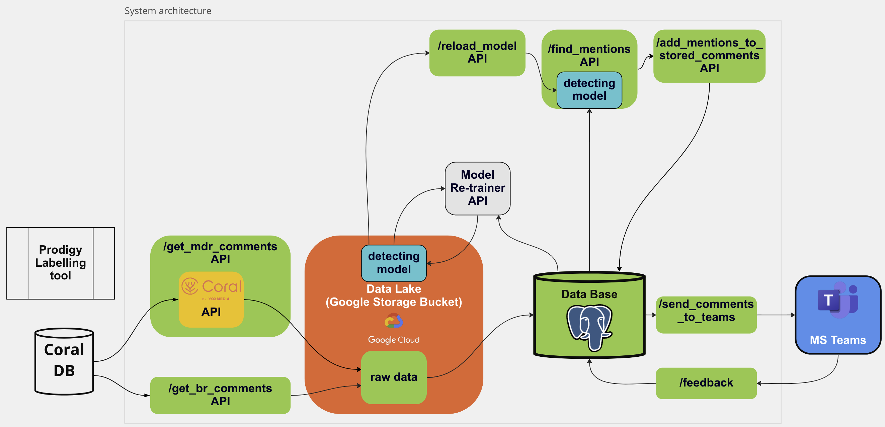

# WTWM Newsroom Mentions Detector

This repository contains the source code of a [joint project](https://interaktiv.br.de/ai-detect-newsroom-mentions-in-comments/) of the [AI + Automation Lab of Bayerischer Rundfunk](https://www.br.de/extra/ai-automation-lab/index.html) (abbr. BR) and [Mitteldeutscher Rundfunk](https://www.mdr.de) (abbr. mdr) as well as [ida](https://idalab.de) to identify user comments that address the newsrooms to foster constructive exchange with our audiences.

This project documents the status of the project work during JournalismAI fellowship in 2022. The fellowship was used by this projects team to explore technical solutions to support the mdr and BRs comment moderation teams. The goal was to allow the moderation teams to engage in real time communication with it's audience. For this purpose we constructed a system to bring comments with direct mentions of the media house to the immediate attention of the moderation team. That involves:

1. fetch the comment instantanenoulsy
2. preprocess the comments
3. store the comments
4. classify the into relevant and irrelevant comments
5. publish the relevant comments to the moderations teams instance
6. forward moderation team to comment in moderation tool
7. collect feedback by moderation team to improve model

Part of the running project is a text classification model that was released on [huggingface](https://huggingface.co/aiautomationlab/wtwm-gpt2-based-mentions-detector).

## Architecture



## Local setup

Create a virtualenv using

`python3.9 -m venv .venv`

`source .venv/bin/activate`

Install dependencies using

`pip3 install -r requirements.txt`

## Usage

Run the API as `uvicorn api:app --host <ip_address> --port <port>`

Necessary settings for the usage of this project can be found in `settings.py`.

The project's APIs are document via the endpoint [/docs](https://wtwm-topic-modelling.brdata-dev.de/docs)

## Deployment

This repository is connected by git actions to the GCloud Kubernetes cluster of BR. Access to the BR infrastructure is restricted to members of the BR.

Necessary settings for the deployment can be found in `config.yml`.

NOTE: To optimize the deployment runtime of this repository, the documented dependencies in `requirements.txt` where refactored into the base image `wtwm-application-base-image` and are configured for inheritance. The image can be adapted from the dependencies in `requirements.txt`.

```
image:
  imageFrom: europe-west3-docker.pkg.dev/brdata-dev/cloud-deploy-images/wtwm-application-base-image
```

## Data source information

The comment data from BR and mdr is provided through APIs external to this repository. To include own comment data APIs follow the example of the endpoints `/v1/get_mdr_comments` and `/v1/get_latest_br_comments`. The comment data must fit the format of the `Comment` class in `src/models.py`. 

## File/Model storage

Data files and the various models are stored in a persistent google bucket that is connected by the deployment routine to the pod.

The classification model, that was last used for the running system, can be found [here](https://huggingface.co/aiautomationlab/wtwm-gpt2-based-mentions-detector).

## Database integration

The processed comments and their mentions are stored in a postgres database instance that is connected by the deployment routine to the pod. 

## API Endpoints

The project's APIs are document via the endpoint [/docs](https://wtwm-topic-modelling.brdata-dev.de/docs)

## Authentication

API endpoints are secured by a bearer token. Requests must include the bearer token to be accepted.
